# The Fire Pit
The Fire Pit is a fictional resturaunt based in Wexford, Ireland. This website is a place where customers can make an account and reserve tables at the resturaunt.
Customers can easily edit and/or cancel their reservations. The resturaunt staff have unique access to view and edit all reservations and they can edit the resturaunts seating capacity.

The link to the live Heroku app is [here](https://the-fire-pit-65d9c073f7cf.herokuapp.com).

# Table of Contents
* [User Experience](#user-experience)
    * [Site Goals](#site-goals)
    * [User Stories](#user-stories)
    * [Agile Planning](#agile-planning)
        * [Milestones](#milestones)
* [Design](#design)
    * [Wireframes](#wireframes)
    * [Database Structure](#database-structure)
    * [Security](#security)
* [Features](#features)
    * [Features to Implement](#features-to-implement)
* [Technologies](#technologies)
* [Testing](#testing)
    * [Unfixed Bugs](#unfixed-bugs)
* [Deployment](#deployment)
    * [Version Control](#version-control)
    * [Deployment to Heroku](#deployment-to-heroku)
    * [Clone the Repository Code Locally](#clone-the-repository-code-locally)
* [Credits](#credits)

# User Experience
## Site Goals
* To provide an easy way for customers to reserve tables at the resturaunt.
* To provide the staff with all the information reagrding the reservations.

## User Stories
* As a user, I want to make a reservation so that I have a table reserved for my group when I go out.
* As a user, I want to make changes to my reservation so that my reservation stays up-to-date with my plans.
* As a staff member, I want to see all reservations so that I can get the tables ready for the customers.
* As a staff memebr, I want to change any reservation, so that all reservations can stay up-to-date.
* As a staff member, I want to be able to change the capacity of the resturaunt, so that we can do outdoor dining and our reservation capacity reflects that.

User Story:
> As a user, I want to make a reservation so that I have a table reserved for my group when I go out.

Acceptance Criteria:
* The user can create and view their reservations with ease

Implementation:
* The user creates an account so that their bookings are visible to only them. The bookings page is easy to navigate to, from there the user can view and create their bookings easily.

User Story:
> As a user, I want to make changes to my reservation so that my reservation stays up-to-date with my plans.

Acceptance Criteria:
* The user can make changes to their reservation.

Implementation:
* From the bookings page, the user can edit and/or cancel each of their bookings with easy to follow prompts.

User Story:
> As a staff member, I want to see all reservations so that I can get the tables ready for the customers.

Acceptance Criteria:
* Only the staff memebers can view all reservations.

Implementation:
* The staff members have unique permissions wich allows them to view all reservations. The can search each reservation by booking reference and by date so that the resturaunt can run smoothly 

User Story:
> As a staff memebr, I want to change any reservation, so that all reservations can stay up-to-date.

Acceptance Criteria:
* Only the staff memebers can change all reservations.

Implementation:
* The staff members have uninque permissions to be able to edit and/or cancel a booking in case a customer calls by phone wanting to change their booking. This way the staff can change the booking and keep it up to date.

User Story:
> As a staff member, I want to be able to change the capacity of the resturaunt, so that we can do outdoor dining and our reservation capacity reflects that.

Acceptance Criteria:
* The staff can change the number of available tables for reservations.

Implementation:
* The staff can set the capacity and amount of three sizes of tables. They can add tables to the available tables so that they can have more reservations.

## Agile Planning
For the development of this website I used a kanban board to aid with keeping me on track. The project board can be found [here](https://github.com/users/Kristfur/projects/2/views/1). Each item had a priority, either "Must Have" or "Should Have". this halped to keep me on track timewise as I could focus on getting the must-haves finishes and I could do the should-haves if time permitted. In addition, each item had a 'story points' value which indicated the amount of work it would take to complete the task. The board consists of 4 sprints, each with about the same number of story points to even out the workload over the sprints.

### Milestones
The project had 6 main milestones:
#### 1: Base Setup
Without these files, the project would not be possible. This it the first milestone as all the rest of the project depents on this being completed. 
#### 2: Stand Alone Pages
Static pages like error pages and the home page are implemented next as it gives the website a structure to build on.
#### 3: Authentication
User register, login, and logout functions were then added, along with creating a database for these users. Also, staff useres were created who have unique permissions.
#### 4: Booking
The next step was to give the registered users the ability to create, read, update and delete their  bookings, along with giveing the staff unique access to all of these bookings.
#### 5: Deployment
Deploying the app to heroku, and making sure the website works while deployed.
#### 6: Documentation
Writing the README and TESTING documentation.

# Features
## Features to Implement

# Design
## Wireframes

Home page

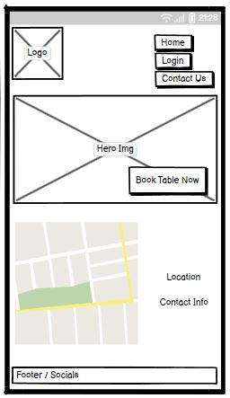
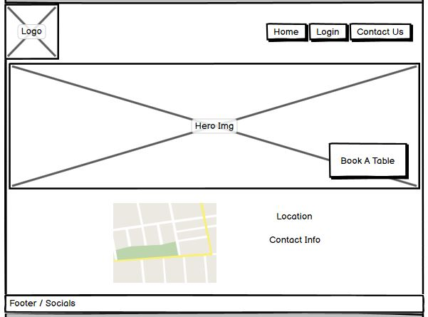

Error page

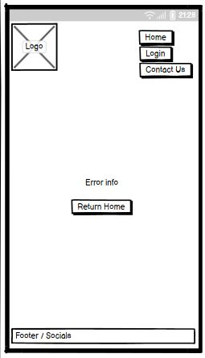
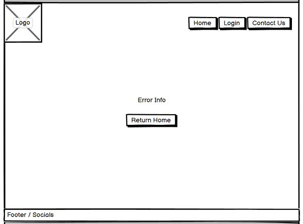

Signup/Login page

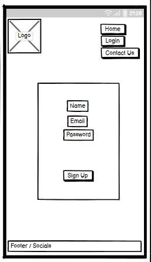
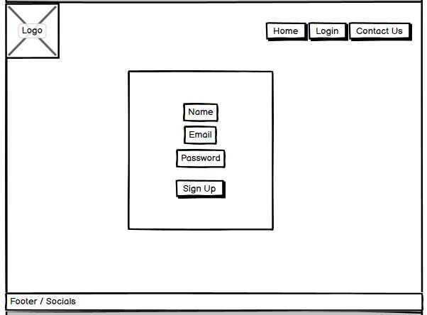

Booking home page

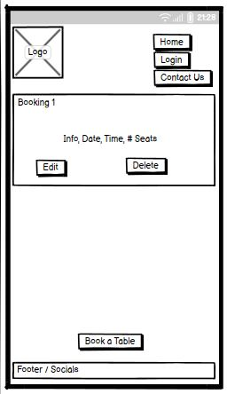
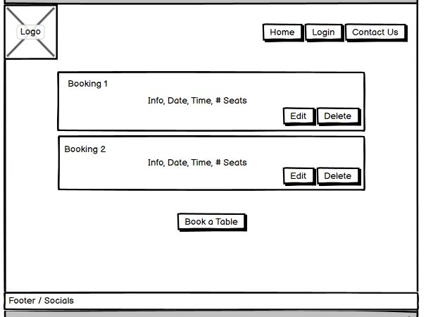

Make booking page

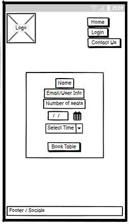
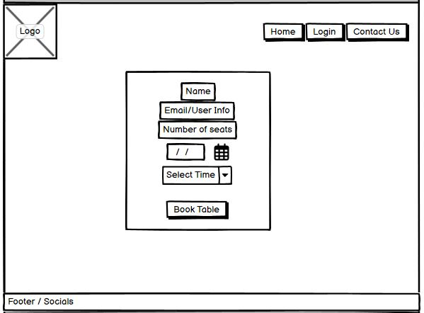

Staff view bookings page

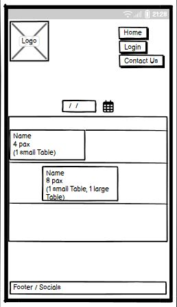
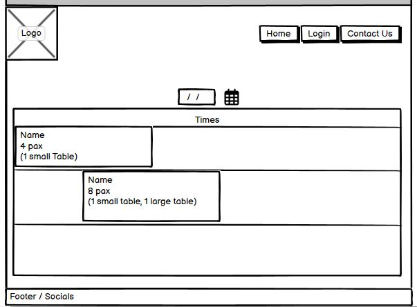

Staff setup page

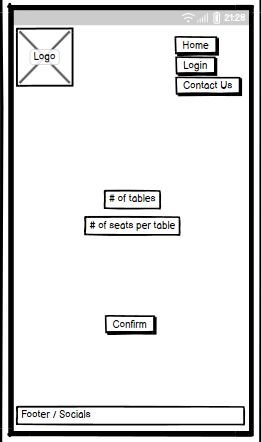
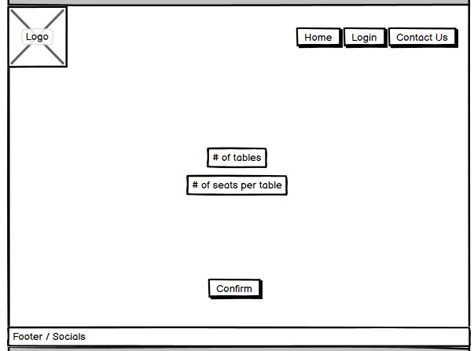

## Database Structure
## Security

# Technologies
- Codeanywhere
    - The game was developed using [Codeanywhere](https://app.codeanywhere.com/).

- GitHub
    - The source code is hosted on [GitHub](https://github.com/Kristfur/the-fire-pit).

- Git
    - Used for version control during the development of the game.

- Python
    - Python was the main language used
    - Python packages used:
        - 

- Heroku
    - The app is hosted on the heroku platform. The live link to the app is [here](https://the-fire-pit-65d9c073f7cf.herokuapp.com).

- Font Awesome
    - Icons for the social media in footer were obtained from [https://fontawesome.com/](https://fontawesome.com/)

- Favicon.io
    - Favicon files were created by [https://favicon.io/](https://favicon.io/)

- balsamiq
    - Wireframe diagrams were created using [balsamiq](https://balsamiq.com/)

- Google Maps Platform
    - Interative map on home page

- Django
    - Project was creted using django

- Bootstrap
    - Bootstrap was used to style the app

- ElephantSQL
    - Hosts the database for the app

# Testing
Throughout development there was constant testing to ensure the functions gave the desired outputs and that there were no unpredictable outcomes.

A more structured testing procedure was also performed. Details of this report can be found [here](TESTING.md).

## Unfixed Bugs
Currently there are no know bugs, if you happen to come across a bug, please let me know and I will address it in a future release.

# Deployment

## Version Control
The following Git commands were used throughout development:

    git add <file> 

Was used to add files to the staging area before they are committed.

    git commit -m "commit message"

Was used to commit changes to the local repository queue.

    git push

Was used to push all committed code to the remote repository on GitHub.

## Deployment to Heroku
The steps for deployment are:

1. Log in to or create your Heroku account
2. Fork or clone this repository
3. Create a new Heroku app
4. In the settings, add config vars
5. Link the Heroku app to the repository
6. Click Deploy

## Clone the Repository Code Locally

The steps to clone the repository are as follows:

1. From the repository, click the *code* drop down menu
2. Click on *HTTPS*
3. Copy the link
4. Open your IDE (that has git installed)
5. Paste the git command into the IDE terminal
6. The project is now cloned on your local machine

# Credits

Python packages:

    - dj-database-url
    - django
    - django-allauth
    - django-crispy-forms
    - crispy-bootstrap5
    - gunicorn
    - psycopg2-binary
    - whitenoise

Website logo was created by me using [Canva](https://www.canva.com/).

The hero image was taken from [Unsplash](https://unsplash.com/).