# The Fire Pit
The Fire Pit is a fictional restaurant based in Wexford, Ireland. This website is a place where customers can make an account and reserve tables at the restaurant.
Customers can easily edit and/or cancel their reservations. The restaurant staff have unique access to view and edit all reservations and they can edit the restaurants seating capacity.

The link to the live Heroku app is [here](https://the-fire-pit-65d9c073f7cf.herokuapp.com).

# Table of Contents
* [User Experience](#user-experience)
    * [Site Goals](#site-goals)
    * [User Stories](#user-stories)
    * [Agile Planning](#agile-planning)
        * [Milestones](#milestones)
* [Design](#design)
    * [Color Scheme](#color-scheme)
    * [Wireframes](#wireframes)
    * [Database Structure](#database-structure)
    * [Security](#security)
* [Features](#features)
    * [Site Wide](#site_wide)
        * [Navbar](#navbar)
    * [Features to Implement](#features-to-implement)
* [Technologies](#technologies)
* [Testing](#testing)
    * [Unfixed Bugs](#unfixed-bugs)
* [Deployment](#deployment)
    * [Version Control](#version-control)
    * [Deployment to Heroku](#deployment-to-heroku)
    * [Clone the Repository Code Locally](#clone-the-repository-code-locally)
* [Credits](#credits)

# User Experience
## Site Goals
* To provide an easy way for customers to reserve tables at the restaurant.
* To provide the staff with all the information regarding the reservations.
* To provide the staff with the ability to search for specific reservations.

## User Stories
* As a user, I want to make a reservation so that I have a table reserved for my group when I go out.
* As a user, I want to make changes to my reservation so that my reservation stays up-to-date with my plans.
* As a staff member, I want to see all reservations so that I can get the tables ready for the customers.
* As a staff member, I want to change any reservation, so that all reservations can stay up-to-date.
* As a staff member, I want to be able to change the capacity of the restaurant, so that we can do outdoor dining and our reservation capacity reflects that.

User Story:
> As a user, I want to make a reservation so that I have a table reserved for my group when I go out.

Acceptance Criteria:
* The user can create and view their reservations with ease

Implementation:
* The user creates an account so that their bookings are visible to only them. The bookings page is easy to navigate to, from there the user can view and create their bookings easily.

User Story:
> As a user, I want to make changes to my reservation so that my reservation stays up-to-date with my plans.

Acceptance Criteria:
* The user can make changes to their reservation.

Implementation:
* From the bookings page, the user can edit and/or cancel each of their bookings with easy to follow prompts.

User Story:
> As a staff member, I want to see all reservations so that I can get the tables ready for the customers.

Acceptance Criteria:
* Only the staff members can view all reservations.

Implementation:
* The staff members have unique permissions which allows them to view all reservations. The can search each reservation by booking reference and by date so that the restaurant can run smoothly 

User Story:
> As a staff member, I want to change any reservation, so that all reservations can stay up-to-date.

Acceptance Criteria:
* Only the staff members can change all reservations.

Implementation:
* The staff members have unique permissions to be able to edit and/or cancel a booking in case a customer calls by phone wanting to change their booking. This way the staff can change the booking and keep it up to date.

User Story:
> As a staff member, I want to be able to change the capacity of the restaurant, so that we can do outdoor dining and our reservation capacity reflects that.

Acceptance Criteria:
* The staff can change the number of available tables for reservations.

Implementation:
* The staff can set the capacity and amount of three sizes of tables. They can add tables to the available tables so that they can have more reservations.

## Agile Planning
For the development of this website I used a kanban board to aid with keeping me on track. The project board can be found [here](https://github.com/users/Kristfur/projects/2/views/1). Each item had a priority, either "Must Have" "Should Have" or "Could Have". I first completed the 'Must Haves' then the 'Should Haves' and the 'Could Haves' if time permitted. This way the core requirements were completed first to give the site a completed feeling and the extra features woubld be completed if time allowed. In addition, each item had a 'story points' value which indicated the amount of work it would take to complete the task. The board consists of 4 sprints, each with about the same number of story points to even out the workload over the sprints.

### Milestones
The project had 6 main milestones:
#### 1: Base Setup
Without these files, the project would not be possible. This it the first milestone as all the rest of the project depends on this being completed. 
#### 2: Stand Alone Pages
Static pages like error pages and the home page are implemented next as it gives the website a structure to build on.
#### 3: Authentication
User register, login, and logout functions were then added, along with creating a database for these users. Also, staff users were created who have unique permissions.
#### 4: Booking
The next step was to give the registered users the ability to create, read, update and delete their bookings, along with giving the staff unique access to all of these bookings.
#### 5: Deployment
Deploying the app to Heroku, and making sure the website works while deployed.
#### 6: Documentation
Writing the README and TESTING documentation.

# Features

## Site Wide

### Navbar

A navbar allows for easy navigation throughout the site, the logo and name of the restaurant are displayed at the top right.

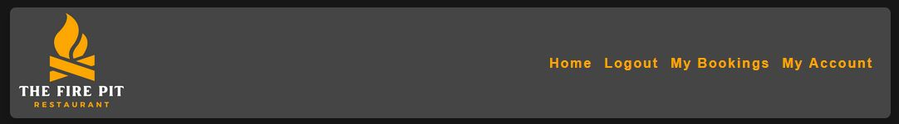

### Footer

The footer displays contact info and provided links to the socials for The Fire Pit for the user to easily find us. The contact information have links that open the user's preferred mailing/calling platform with our email/phone number already dialed for easy contacting.

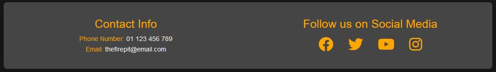

### Favicon

The favicon is the recognizable company logo. It Allows the user to easily identify the website from browser tabs.

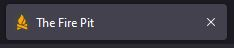

### Error pages

The 404, 403 and 500 errors will tell the user that an error has occurred and provide a button back to the home page, this helps the user to not get lost.

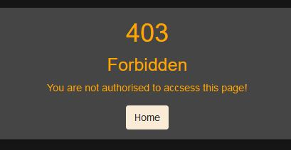

## Hero Image

An eye-catching image with a zoom animation on load gets the users attention when the first visit the site. The image contains a call-to-action bottom prompting them to book a table, which when clicked will redirect the user to the bookings page, or the sign in page if not already.

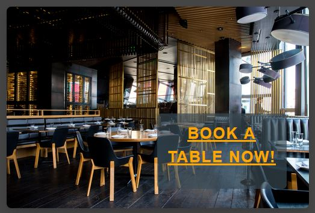

## Interactive Map and Information

A map that shows the exact location of the restaurant, as well as giving the user the option to explore the surrounding area by panning and zooming the map. This is done using the google maps Api. Alongside the map is more information that the user would find helpful.

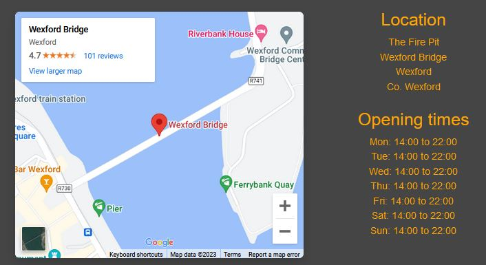

## User Authentication

To book a table, first you must create an account. Users can register, sign in and sign out. This allows each user to create and edit bookings that only they and the restaurant staff can see/edit. the users can also view their account information in the 'My Account' tab in the navbar.

Sign In Page

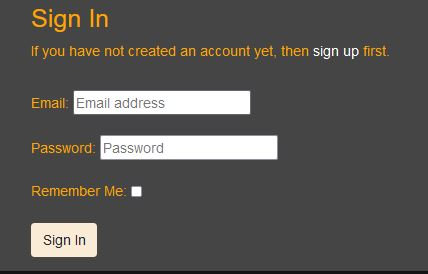

My Account Tab

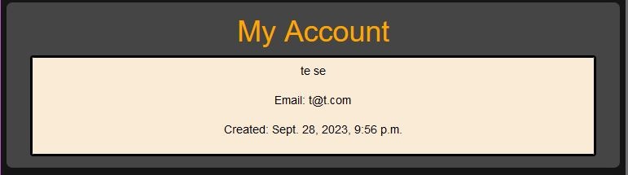

## Bookings

Once registered, a user can create bookings that are then stored in a database. They have full CRUD functionality for these bookings, and only they can change them (and restaurant staff accounts). This gives the user an easy way to reserve tables at out restaurant, and to view and change their reservation hassle free.

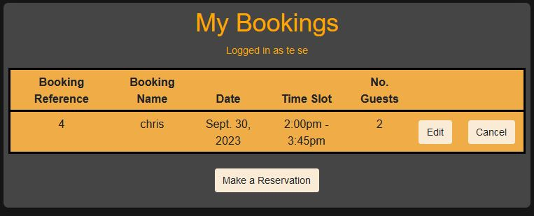

## Staff Features

Staff are users with unique permissions that allow them to do more than the normal user. Staff are workers at the restaurant that can view and edit all bookings, as well as edit the 'Available Bookings' model through the table setup page. Staff can change the number of available tables for bookings (for seasonal outdoor dining), they can also search bookings by reference number, and search by date to view all booking for a particular day. In each booking item, staff can see the table sizes and amount needed for the booking, so they can set them up accordingly before the guests arrive.

Staff booking page on small screens

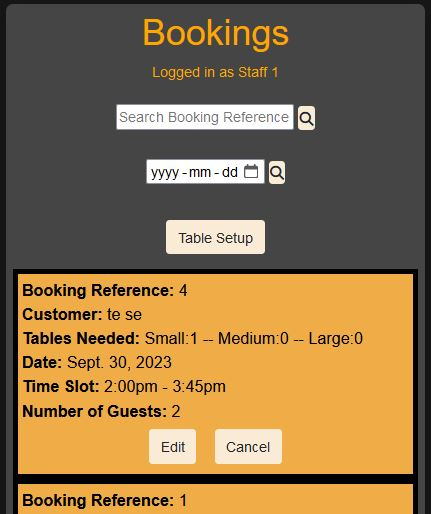

Staff booking page on large screens

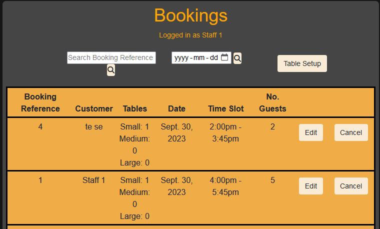

Staff table setup page

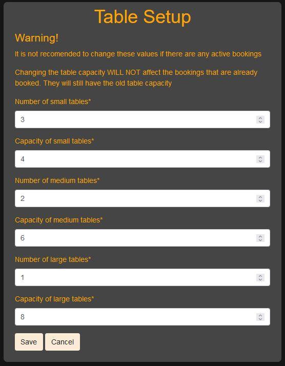

## Features to Implement

- User email verification, to ensure that every user has a valid email address.
- Ability for users to edit their account information, to change their name or email.
- The ability for users to create accounts and login with their google account for easily registering as a new user.
- Optimize the allotment of tables, as currently each table have a set capacity and if a booking calls for 2 tables, the allotment will not take into account combining two tables into one larger table (the total table capacity will decrease by 2 seats where the tables connect).
- Redistribute tables after a staff member changes the table capacities to reflect the new capacities, and forbid the staff if the new capacity cannot accommodate the current bookings.

# Design

## Color Scheme

The main colors for the site are (#454545) for the background and (#fea601) for the text. These colors were chosen to go with the theme of the restaurant, a fire pit. 

## Wireframes

Home page

Error page

Signup/Login page

Booking home page

Make booking page

Staff view bookings page

Staff setup page

## Database Structure

The database was designed to for users to have full CRUD functionality for their bookings. Every user can only access their own bookings unless they are staff. 

The user model is connected to the bookings customer field and to the available bookings updated_by field, so that the staff users can see the owner user of the bookings.

When a user is creating a booking, the booking form validation references the available bookings and all other bookings for that time to see if there are seats available.

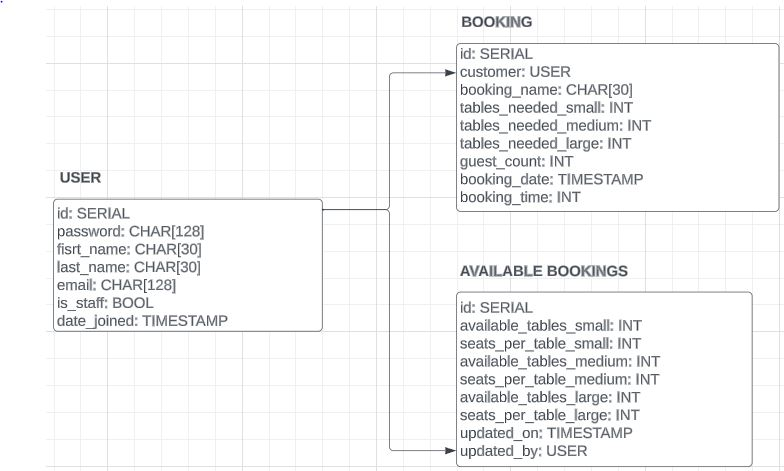

## Security

For security when submitting forms, csrf tokens were used. LoginRequiredMixin is used for when a user wants to create, read, update or deletes bookings to ensure the user is authenticated. In addition, UserPassesTestMixin is used for when the user wants to update an existing booking to ensure that only the creator of the booking can edit it. The staff users can bypass these tests and change any booking.

# Technologies
- Codeanywhere
    - The site was developed using [Codeanywhere](https://app.codeanywhere.com/).

- GitHub
    - The source code is hosted on [GitHub](https://github.com/Kristfur/the-fire-pit).

- Git
    - Used for version control during the development of the website.

- Python
    - Python was the main language used for the backend.

- Heroku
    - The app is hosted on the Heroku platform. The live link to the app is [here](https://the-fire-pit-65d9c073f7cf.herokuapp.com).

- Font Awesome
    - Icons for the social media in footer were obtained from [https://fontawesome.com/](https://fontawesome.com/)

- Favicon.io
    - Favicon files were created by [https://favicon.io/](https://favicon.io/)

- balsamiq
    - Wireframe diagrams were created using [balsamiq](https://balsamiq.com/)

- Google Maps Platform
    - Interative map on home page

- Django
    - Project was created using django

- Bootstrap
    - Bootstrap was used to style the app

- ElephantSQL
    - Hosts the database for the app

# Testing
Throughout development there was constant testing to ensure the functions gave the desired outputs and that there were no unpredictable outcomes.

A more structured testing procedure was also performed. Details of this report can be found [here](TESTING.md).

## Unfixed Bugs
Currently there are no know bugs, if you happen to come across a bug, please let me know and I will address it in a future release.

# Deployment

## Version Control
The following Git commands were used throughout development:

    git add <file> 

Was used to add files to the staging area before they are committed.

    git commit -m "commit message"

Was used to commit changes to the local repository queue.

    git push

Was used to push all committed code to the remote repository on GitHub.

## Set up ElephantSQL database
The steps for setting up are:

1. Log in to or create your ElephantSQL account
2. Create new instance
3. Give it a name
4. Select the Tiny Turtle plan (free)
5. Select your region
6. Create
7. Copy URL to env.py and/or Heroku config vars

## Deployment to Heroku
The steps for deployment are:

1. Log in to or create your Heroku account
2. Fork or clone this repository
3. Create a new Heroku app
4. In the settings, add config vars (DATABASE_URL, SECRET_KEY)
5. Link the Heroku app to the repository
6. Click Deploy

## Clone the Repository Code Locally

The steps to clone the repository are as follows:

1. From the repository, click the *code* drop down menu
2. Click on *HTTPS*
3. Copy the link
4. Open your IDE (that has git installed)
5. Paste the git command into the IDE terminal
6. The project is now cloned on your local machine

# Credits

Python packages:

    - dj-database-url
    - django
    - django-allauth
    - django-crispy-forms
    - crispy-bootstrap5
    - gunicorn
    - psycopg2-binary
    - whitenoise

Website logo was created by me using [Canva](https://www.canva.com/).

The hero image was taken from [Unsplash](https://unsplash.com/).