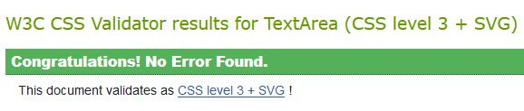

# Categories
* [HTML Validation](#html-validation)
* [CSS Validation](#css-validation)
* [Responsiveness](#responsiveness)
* [Accessibility](#accessibility)
* [Navigation Links](#navigation-links)
* [Input Validation](#input-validation)
* [User Authentication](#user-authentication)
* [Database](#database)
* [Staff Functions](#staff-functions)

## HTML Validation

HTML passes the [W3C Validator](https://validator.w3.org/)

With one exception:
On the register page crispy forms was used for the user creation form. The helptext for the password has a span with a ul inside, inside of a p element. This throws an error on the validator as it claims there is no closing tag for the p nor the span, but there is one of each after the ul element inside the span. I am not sure why this error is occurring.

## CSS Validation

CSS passes the [(Jigsaw) Validator](https://jigsaw.w3.org/css-validator/)

## Responsiveness

The site was tested for responsiveness on the following browsers:
    - Firefox
    - Chrome
    - Edge
    - Opera

And it was tested on the following:
    - iPhone 8
    - Samsung Galaxy 8

All resulted in responsive design.

## Accessibility

The [Wave Accessibility](https://wave.webaim.org/) tool was used for accessibility testing. 

Testing was focused on the following:
- The hero image elements had an alt description for a screen reader to read out
- All forms have labels for each input for a screen reader to read out
- All links to external pages have proper aria labels
- Color contrast for text meets the minimum ratio

## Navigation Links

All the navigation links in the header go to the correct place.

All the navigation links in the footer go to the correct place.

The signup, signout and register forms redirect to the correct place.

The create, edit and delete booking forms all redirect to the correct places.

The table setup form redirects to the correct place.

## Input Validation

### Register

|Description|Step|Step Description|Expected Result|Actual Result|Pass\Fail
|-|-|-|-|-|-
|Input is checked to ensure it is a valid input|1|Navigate to the register page (click 'Register' after each step)
| |2|Click 'Register'|Error, Please fill in email|As expected|Pass
| |3|Fill email field with 'hello'|Error, Please enter an email|As expected|Pass
| |4|Fill email field with 'test@test.com'|Error, Please enter a first name|As expected|Pass
| |5|Fill first name field with 'Test'|Error, Please enter a last name|As expected|Pass
| |6|Fill last name field with 'Test'|Error, Please enter a password|As expected|Pass
| |7|Fill password field with 'Test'|Error, Please enter a longer password|As expected|Pass
| |8|Fill password field with 'test4321'|Error, Please enter password again|As expected|Pass
| |9|Fill password-2 field with 'Test'|Error, Please password do not match|As expected|Pass
| |10|Fill password-2 field with 'test4321'|User is registered, data is saved to database, user redirected to my bookings page|As expected|Pass

### Login

|Description|Step|Step Description|Expected Result|Actual Result|Pass\Fail
|-|-|-|-|-|-
|Input is checked to ensure it is a valid input|1|Navigate to the login page (click 'Sign in' after each step)
| |2|Click 'Sign In'|Error, Please fill in email|As expected|Pass
| |3|Fill email field with 'hello'|Error, Please enter an email|As expected|Pass
| |4|Fill email field with 'test@test.com'|Error, Please enter a password|As expected|Pass
| |5|Fill password field with 'hello'|Error, email/password is not correct|As expected|Pass
| |6|Fill password field with 'test4321'|User is logged in, redirected to my bookings page|As expected|Pass

### Booking

|Description|Step|Step Description|Expected Result|Actual Result|Pass\Fail
|-|-|-|-|-|-
|Input is checked to ensure it is a valid input|1|Log in, Navigate to the my bookings page, click 'Make a reservation' (click 'Create' after each step)
| |2|Click 'Create'|Error, Please fill in booking name|As expected|Pass
| |3|Fill booking name field with 'hello'|Error, Please choose a date|As expected|Pass
| |4|Select a date in the past|Error, Please choose a date in the future|As expected|Pass
| |5|Select a date in the future, then select 0 as number of guests|Error, you must have at least one guest|As expected|Pass
| |6|Select 100 guests|Error, there are not enough tables|As expected|Pass
| |7|Select 10 guests|Booking is created, booking is saved to database, user redirected to my bookings page|As expected|Pass

### Table Setup (Staff)

|Description|Step|Step Description|Expected Result|Actual Result|Pass\Fail
|-|-|-|-|-|-
|Input is checked to ensure it is a valid input|1|Log in as staff, Navigate to the my bookings page, click 'Table setup' (click 'Save' after each step)
| |2|Reduce capacity of large tables to 4|Error, table capacities must scale with size|As expected|Pass
| |3|Reduce all values to 0|Error, you have bookings with reserved tables|As expected|Pass
| |4|Increase number of small tables to 6|Available booking is updated in database, user is redirected to my bookings page|As expected|Pass

### Search Booking Reference (Staff)

|Description|Step|Step Description|Expected Result|Actual Result|Pass\Fail
|-|-|-|-|-|-
|Input is checked to ensure it is a valid input|1|Log in as staff, Navigate to the my bookings page (click 'Search' after each step)
| |2|Enter 10000 into search by booking reference|No booking show up in results|As expected|Pass
| |3|Enter 1 into search by booking reference|Booking by id of 1 shows up in results|As expected|Pass
| |4|Click 'Reset Search'|All future booking appear in results|As expected|Pass

### Search By Date (Staff)

|Description|Step|Step Description|Expected Result|Actual Result|Pass\Fail
|-|-|-|-|-|-
|Input is checked to ensure it is a valid input|1|Log in as staff, Navigate to the my bookings page (click 'Search' after each step)
| |2|Select 01/01/2023 into search by booking date|No booking show up in results|As expected|Pass
| |3|Select 30/09/2023|All bookings  on that day show in results|As expected|Pass
| |4|Click 'Reset Search'|All future booking appear in results|As expected|Pass

## User Authentication

When a user is created, all of the required information is saved to the database correctly.

The user logs in and logs out correctly.

## Bookings

When a user creates a booking, the booking is saved to the database correctly.

When a user edits a booking, the booking is updated in the database correctly.

When a user deletes a booking, the booking is deleted from the database correctly.

When a user tries to edit a booking that does not exist, a 404 error is displayed.

When a user (excluding staff) tries to edit a booking that does not belong to them, a 403 error is displayed.

When a staff user tries to edit a booking that does not belong to them, the booking is updated in the database correctly.